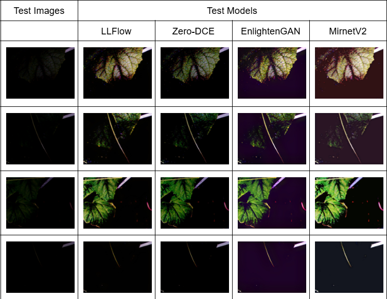
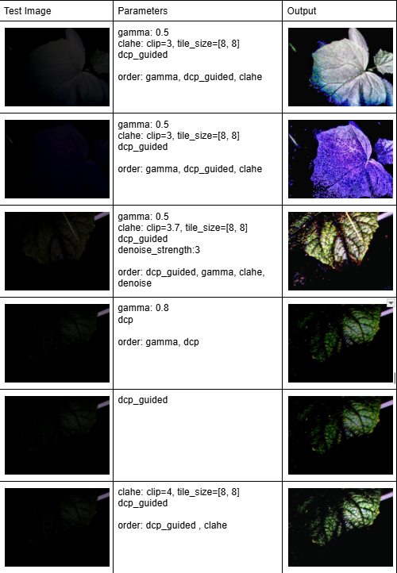
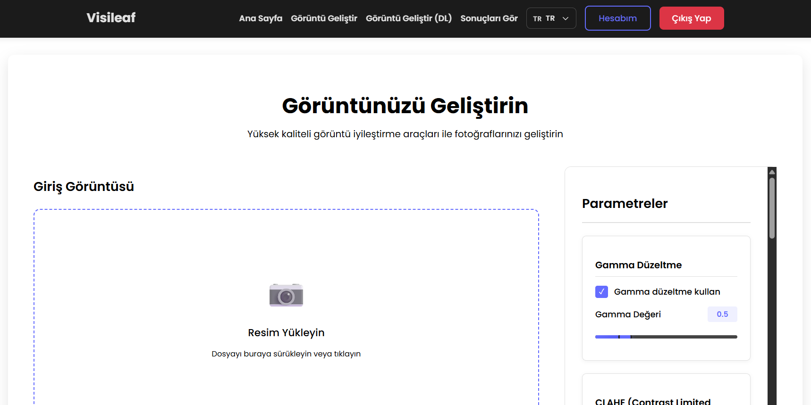
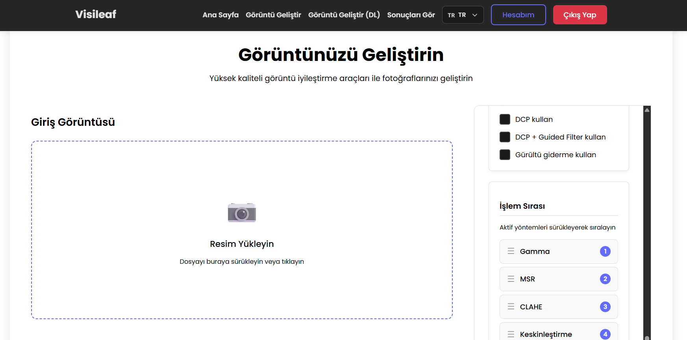
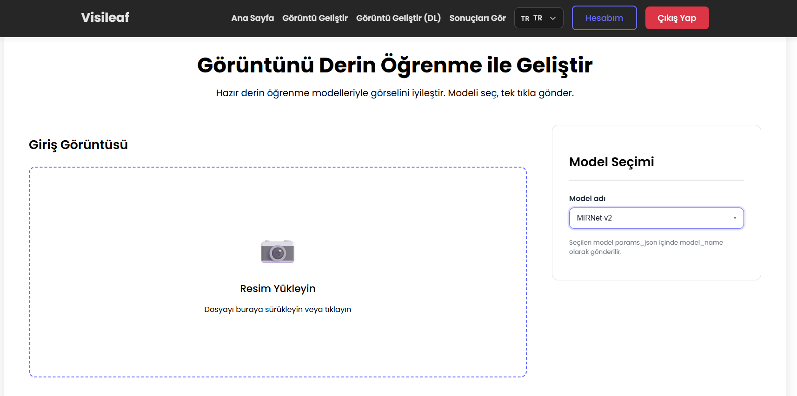
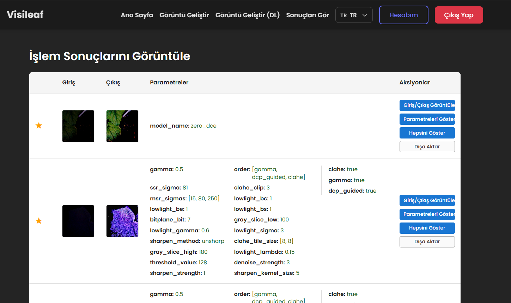
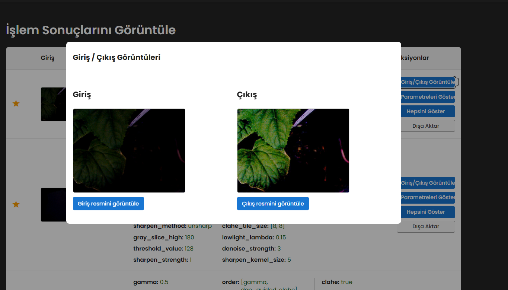

# Visileaf

## Table of Contents

- [📖 Introduction](#introduction)
- [✨ Features](#features)
- [🖼️ Example Screenshots](#example-screenshots)
  - [🧠 Test with Deep Learning Models](#test-with-deep-learning-models)
  - [🖼️ Test with Image Processing Techniques](#test-with-image-processing-techniques)
- [🔧 Technologies Used](#technologies-used)
  - [🖥️ Frontend](#frontend)
  - [🧠 Backend](#backend)
  - [📊 Database](#database)
  - [📊 Model Training](#model-training)
- [⬇️ Installation Instructions](#installation-instructions)
  - [📚 Training Models Using .ipynb Files (Google Colab)](#training-models-using-ipynb-files-google-colab)
  - [🧪 Testing Trained Models with Web Application](#testing-trained-models-with-web-application)
  - [📁 Complete Folder Structure](#complete-folder-structure)
- [🔗 References](#references)
- [📧 Contact](#contact)

## Introduction

Visileaf is a web application that allows you to enhance images using both classical image processing techniques and state-of-the-art deep learning models.

This repository includes:

- Source code for training and experimentation in Google Colab notebooks
- A backend API built with FastAPI for image enhancement using various techniques and deep learning models
- A web application built with React.js for visualizing and comparing image enhancement results

## Features

- **Image Enhancement** - Enhance low-light images using classical image processing techniques
- **Deep Learning Model Enhancement** - Leverage state-of-the-art deep learning models for superior image quality
- **Image Processing** - Apply various image processing algorithms for enhancement

## Example Screenshots

### Test with Deep Learning Models



### Test with Image Processing Techniques




## Technologies Used

### Frontend

- React.js – For building interactive user interfaces
- CSS – Styling and layout
- Responsive Design – Ensures usability across devices

### Backend

- Python – Core programming language
- FastAPI – High-performance web framework for serving the model
- PyTorch – Deep learning framework for building and deploying the detection model

### Database

- PostgreSQL - For storing user data and image enhancement results
- Docker - For containerizing the database

### Model Training

- Google Colab – Cloud-based environment used for training and experimenting with models


## Installation Instructions

### Training Models Using .ipynb Files (Google Colab)

1. Navigate to the `colab_training_files` directory
2. Select the folder corresponding to the model you wish to train
3. Download the corresponding `.ipynb` (Jupyter Notebook) file
4. Download the `dataset.zip` file provided
5. Unzip the `dataset` archive
6. Upload the `.ipynb` file to your Google Colab environment
7. Upload the unzipped `dataset` folder to your Google Drive
8. Follow the instructions in the notebook to:
   - Mount Google Drive
   - Locate the dataset path
   - Begin training by running the notebook cells step-by-step

### Testing Trained Models with Web Application

#### Prerequisites

**1. Install Docker**

Make sure Docker is installed on your system before proceeding. You can download it from:
[Docker Get Started](https://www.docker.com/get-started/)

**2. Clone the Repository**

```bash
git clone https://github.com/cemlevet54/visileaf.git
```

**3. Navigate to the Project Directory**

```bash
cd visileaf
```

**4. Build and Run the Docker Container for the Database**

```bash
cd postgres
docker compose up -d
```

For detailed instructions on using Docker with the database, please refer to:
[How to Use Database with Docker](https://www.cemleventavci.com.tr/blogs/deployment/how-to-use-database-with-docker)

**5. Download and Prepare the Dataset**

> **Note:** The dataset link will be added here. Please check the repository for the latest dataset information.

- Download the `dataset.zip` file
- Unzip the archive
- Move the `dataset` folder into the project root directory

**6. Create a .env File in the Backend Directory**

```bash
cd backend
touch .env
```

**7. Configure Environment Variables**

Add the following environment variables to the `.env` file in the backend directory:

```env
ENV=development
PORT=8080
#DEBUG, INFO, WARNING, ERROR, CRITICAL
LOG_LEVEL=INFO

# Cors Configurations
CORS_ALLOWED_ORIGINS=

# Database Configurations
DB_HOST=
DB_PORT=
DB_NAME=
DB_USER=
DB_PASSWORD=


# Swagger Configurations
SWAGGER_TITLE=Visileaf API
SWAGGER_DESCRIPTION=Visileaf API Documentation
SWAGGER_VERSION=1.0.0
SWAGGER_DOCS_URL=/docs
SWAGGER_REDOC_URL=/redoc
SWAGGER_OPENAPI_URL=/openapi.json

# JWT Configurations
JWT_SECRET_KEY=
ACCESS_TOKEN_EXPIRE_MINUTES=
REFRESH_TOKEN_EXPIRE_DAYS=

# Mail Configurations
RESEND_API_KEY=
```

**8. Run the Backend**

```bash
cd backend
python -m venv .venv
.venv\Scripts\activate.bat
pip install -r requirements.txt
uvicorn app.main:app --host 0.0.0.0 --port 8000 --reload
```

**9. Configure Frontend Environment Variables**

Create a `.env` file in the frontend directory and add:

```env
VITE_API_URL=http://localhost:8000
```

**10. Run the Frontend**

```bash
cd frontend
npm install
npm run dev
```

**11. Access the Web Application**

Open your browser and navigate to: [http://localhost:3000](http://localhost:3000)

**12. Register a New Account**

To test the web application, first register a new account at:
[http://localhost:3000/register](http://localhost:3000/register)

**13. Test Image Enhancement Features**

You can test and view image enhancement results using the following pages:

#### Enhance Your Image

<table>
<tr>
<td></td>
<td></td>
</tr>
</table>

Access at: [http://localhost:3000/enhance-your-image](http://localhost:3000/enhance-your-image)

#### Enhance Your Image With Deep Learning

<table>
<tr>
<td></td>
</tr>
</table>

Access at: [http://localhost:3000/with-deep-learning](http://localhost:3000/with-deep-learning)

#### See Results




Access at: [http://localhost:3000/see-results](http://localhost:3000/see-results)

### Complete Folder Structure

The project follows a well-organized structure. Below is the complete folder hierarchy:

```
visileaf
|
├── backend
│   ├── app
│   │   ├── config
│   │   │   └── alembic
│   │   ├── controllers
│   │   ├── helpers
│   │   │   ├── EnlightenGAN
│   │   │   ├── LLFlow
│   │   │   ├── MIRNetv2
│   │   │   └── Zero-DCE
│   │   ├── locales
│   │   ├── middleware
│   │   ├── migrations
│   │   ├── models
│   │   ├── repositories
│   │   ├── routes
│   │   ├── schemas
│   │   ├── services
│   │   ├── templates
│   │   ├── utils
│   │   └── weight_and_models
│   │       ├── EnlightenGAN
│   │       ├── LLFlow
│   │       ├── MIRNetv2
│   │       └── Zero-DCE
│   ├── checkpoints
│   ├── cmds
│   ├── docs
│   └── uploads
│
├── colab_training_files
│   └── Zero-DCE
|
├── dataset
│   ├── 2024-05-18
│   └── F
│       ├── set1
│       └── set2
|
├── docs
│   └── images
|
├── frontend
│   ├── src
│   │   ├── components
│   │   │   ├── checkbox
│   │   │   ├── input
│   │   │   ├── language-switcher
│   │   │   ├── navbar
│   │   │   ├── radio-button
│   │   │   ├── select
│   │   │   ├── snackbar
│   │   │   └── volume-slider
│   │   ├── contexts
│   │   ├── hooks
│   │   ├── i18n
│   │   ├── pages
│   │   │   ├── enhance-your-image
│   │   │   ├── enhance-your-image-with-deep-learning
│   │   │   ├── forgot-password
│   │   │   ├── login
│   │   │   ├── register
│   │   │   ├── reset-password
│   │   │   └── see-results
│   │   ├── services
│   │   └── utils
│   └── public
|
├── postgres
|
├── python
│   └── results
|
└── README.md
```

## References

- [IS566 Image Processing | Low-Light Image Enhancement Using Classical Image Processing Algorithms](https://www.youtube.com/watch?v=adqncBBvXzU)
- [EnlightenGAN: Deep Light Enhancement without Paired Supervision](https://github.com/VITA-Group/EnlightenGAN)
- [AAAI 2022 Oral | Low-Light Image Enhancement with Normalizing Flow](https://github.com/wyf0912/LLFlow)
- [Learning Enriched Features for Fast Image Restoration and Enhancement (TPAMI 2022)](https://github.com/swz30/MIRNetv2)
- [Zero-Reference Deep Curve Estimation for Low-Light Image Enhancement](https://github.com/Li-Chongyi/Zero-DCE)

## Contact

For any questions or support, please contact: **cemlevent54@gmail.com**