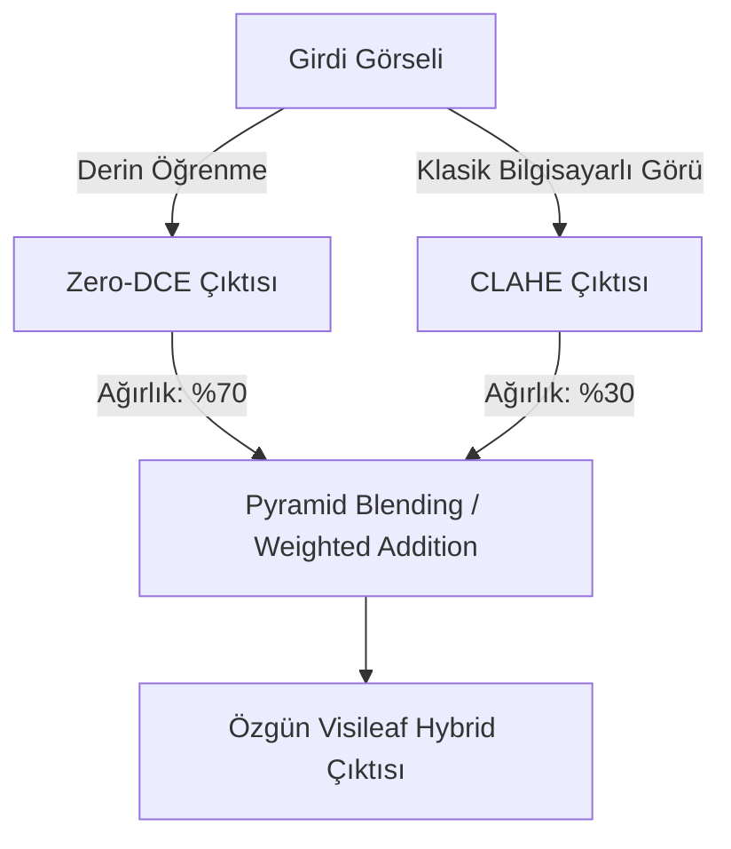

# Visileaf Projesi: İleri Düzey Geliştirme Önerileri (Masterclass Proposals)

Bu doküman, **Visileaf** uygulamasını basit bir ders projesinden çıkarıp bilgisayarlı görü ve yapay zeka mühendisliği alanında dünya standartlarında bir portföy projesine (Masterclass Seviyesi) dönüştürecek yenilikçi mimari ve algoritmik eklentileri teknik detayları ve kod taslakları ile sunmaktadır.

---

## 1. 🎥 Video İyileştirme Desteği (Video Low-Light Enhancement)
Görsellerin yanı sıra, kullanıcının yükleyeceği kısa `.mp4` videolarındaki düşük ışık ve pozlama problemlerini gidermek, projenin değerini katlayacak en büyük adımdır.

### ⚠️ Zamansal Tutarlılık (Temporal Consistency) Problemi:
Videolar kare kare bağımsız işlendiğinde, piksellerdeki ışık dalgalanmalarından ötürü videoda kırpışmalar (flickering) oluşur. Bunu çözmek için ardışık kareler arasında zamansal filtreleme (temporal filtering) uygulanmalıdır.

### Backend Python Kod Taslağı:
```python
# video_processor.py - Örnek Taslak
import cv2
import numpy as np
import subprocess
import os

def process_lowlight_video(input_video_path: str, output_video_path: str, enhance_func):
    """
    Videoyu karelerine ayırır, iyileştirme fonksiyonunu uygular ve zamansal filtreleme yapar.
    """
    cap = cv2.VideoCapture(input_video_path)
    fps = cap.get(cv2.CAP_PROP_FPS)
    width = int(cap.get(cv2.CAP_PROP_FRAME_WIDTH))
    height = int(cap.get(cv2.CAP_PROP_FRAME_HEIGHT))
    
    # Geçici sessiz video yazıcı
    temp_output = "temp_silent.mp4"
    fourcc = cv2.VideoWriter_fourcc(*'mp4v')
    out = cv2.VideoWriter(temp_output, fourcc, fps, (width, height))
    
    prev_enhanced_frame = None
    alpha = 0.7  # Zamansal düzleştirme katsayısı (flicker önleme)

    while cap.isOpened():
        ret, frame = cap.read()
        if not ret:
            break
            
        # 1. Kareyi iyileştir (Örn: Zero-DCE veya LIME ile)
        enhanced_frame = enhance_func(frame)
        
        # 2. Zamansal Düzleştirme (Temporal Smoothing)
        if prev_enhanced_frame is not None:
            # I(t) = alpha * I(t) + (1 - alpha) * I(t-1)
            enhanced_frame = cv2.addWeighted(enhanced_frame, alpha, prev_enhanced_frame, 1 - alpha, 0)
            
        prev_enhanced_frame = enhanced_frame.copy()
        out.write(enhanced_frame)
        
    cap.release()
    out.release()
    
    # 3. Orijinal sesi ffmpeg kullanarak geri ekle
    # (Süreçte ses kaybını önlemek için)
    cmd = f"ffmpeg -y -i {input_video_path} -i {temp_output} -map 0:a? -map 1:v -c:v copy -c:a aac {output_video_path}"
    subprocess.run(cmd, shell=True)
    
    if os.path.exists(temp_output):
        os.remove(temp_output)
```

---

## 🪄 2. "Magic Auto-Enhance" (Yapay Zeka Destekli Otomatik Mod)
Kullanıcının algoritmalar arasında kaybolmasını önlemek için resmin istatistiksel analizini yaparak en uygun algoritmayı otomatik seçen sihirli bir buton tasarımıdır.

### Karar Mekanizması Parametreleri:
* **Ortalama Parlaklık (Mean Brightness):** $\mu = \frac{1}{HW}\sum_{x,y} I(x,y)$
* **Kontrast Seviyesi (RMS Contrast):** $\sigma = \sqrt{\frac{1}{HW}\sum_{x,y} (I(x,y) - \mu)^2}$
* **Görüntü Entropisi (Detail Density):** Resimdeki detay yoğunluğunu ölçer.

### Python Analiz Modülü:
```python
# auto_analyzer.py
import cv2
import numpy as np

def analyze_and_suggest_method(img: np.ndarray) -> dict:
    """
    Görüntünün histogram ve kontrast değerlerini analiz ederek en iyi algoritmayı önerir.
    """
    gray = cv2.cvtColor(img, cv2.COLOR_BGR2GRAY)
    mean_val = np.mean(gray)
    std_val = np.std(gray)
    
    # Kenar yoğunluğu tespiti (gürültü analizi için)
    edges = cv2.Canny(gray, 100, 200)
    edge_density = np.sum(edges > 0) / (gray.shape[0] * gray.shape[1])
    
    suggestion = {
        "method": "clahe",
        "params": {},
        "reason": ""
    }
    
    if mean_val < 50:  # Görüntü aşırı karanlık
        if edge_density > 0.05: # Çok fazla gürültü/detay riski var
            suggestion["method"] = "zero-dce"  # Zero-DCE gürültüyü az artırır
            suggestion["reason"] = "Aşırı düşük ışık ve yüksek detay yoğunluğu tespit edildi. Derin Öğrenme modeli önerilir."
        else:
            suggestion["method"] = "lime"
            suggestion["params"] = {"gamma": 0.5, "lambda_": 0.15}
            suggestion["reason"] = "Düşük ışıklı ve homojen alanlar tespit edildi. LIME optimizasyonu önerilir."
    elif std_val < 30:  # Işık normal ama kontrast çok düşük (puslu resimler)
        suggestion["method"] = "dcp_guided"
        suggestion["reason"] = "Düşük kontrast ve puslu atmosfer tespit edildi. Guided Filter tabanlı DCP önerilir."
    else:
        suggestion["method"] = "clahe"
        suggestion["params"] = {"clip_limit": 2.0}
        suggestion["reason"] = "Resim genel olarak dengeli fakat kontrast iyileştirmesine ihtiyaç duyuyor. CLAHE önerilir."
        
    return suggestion
```

---

## 🔗 3. "Visileaf Hybrid" Algoritması (Sentez Yöntem)
Derin öğrenme modelleri (Zero-DCE vb.) global aydınlatmayı mükemmel çözerken, bazen lokal kontrast ve keskinlik detaylarını kaçırabilir. Klasik metotlar (CLAHE vb.) ise tam tersine detaylarda başarılıdır. İki yöntemi birleştiren özgün bir hibrit boru hattı (pipeline) tasarlanabilir.



### Python İmplementasyon Taslağı:
```python
def apply_visileaf_hybrid(img: np.ndarray, dl_service, enhancement_service) -> np.ndarray:
    # 1. Derin öğrenme ile aydınlatma yap (Zero-DCE)
    dl_enhanced = dl_service.run_zero_dce_raw(img)
    
    # 2. Klasik yöntemle detayları güçlendir (CLAHE)
    classical_enhanced = enhancement_service.apply_clahe_to_image(img, clip_limit=1.5)
    
    # 3. İki görüntüyü frekans tabanlı harmanla (Laplacian Pyramid Blending)
    # Basit yöntem (Ağırlıklı toplama):
    hybrid_output = cv2.addWeighted(dl_enhanced, 0.7, classical_enhanced, 0.3, 0)
    
    return hybrid_output
```

---

## 🌐 4. WebAssembly (Wasm) ile Tarayıcıda (Edge) İşleme
Klasik algoritmaları sunucuya göndermeden doğrudan kullanıcının tarayıcısında çalıştırmak, web uygulamasını aşırı duyarlı (zero-latency) hale getirir ve sunucu işlem yükünü sıfırlar.

### Entegrasyon Mimarisi:
1. **OpenCV.js CDN** üzerinden frontend'e yüklenir.
2. Kullanıcı slider'ı oynattığı anda resim tarayıcıda Canvas üzerinde işlenir.

```html
<!-- index.html -->
<script async src="https://docs.opencv.org/4.8.0/opencv.js" type="text/javascript"></script>
```

```typescript
// browser_enhancer.ts - Frontend OpenCV.js kullanımı
declare const cv: any;

export const applyGammaInBrowser = (canvasId: string, outputCanvasId: string, gamma: number) => {
  let src = cv.imread(canvasId);
  let dst = new cv.Mat();
  
  // Gamma lookup table (LUT) oluştur
  let lut = new cv.Mat(1, 256, cv.CV_8U);
  for (let i = 0; i < 256; i++) {
    lut.data[i] = Math.pow(i / 255.0, gamma) * 255.0;
  }
  
  cv.LUT(src, lut, dst);
  cv.imshow(outputCanvasId, dst);
  
  src.delete();
  dst.delete();
  lut.delete();
};
```

---

## 📸 5. EXIF Metadata Analizi ve Korunması
Akıllı telefonlar veya profesyonel kameralar tarafından çekilen fotoğraflarda bulunan EXIF (diyafram, ISO, pozlama süresi, kamera modeli) bilgilerini analiz etmek ve çıktı resminde bu verileri kaybetmeden korumak profesyonel bir fotoğraf ürünü için olmazsa olmazdır.

### Python EXIF Kütüphaneleri:
* `exifread` (EXIF okumak için)
* `piexif` (EXIF verilerini korumak ve çıktı resmine geri yazmak için)

### Backend Uygulama Adımları:
```python
# metadata_manager.py
import exifread
import piexif

def extract_exif_metadata(image_bytes: bytes) -> dict:
    """
    Resmin EXIF verilerini okur ve anlamlı bir JSON formatına getirir.
    """
    import io
    f = io.BytesIO(image_bytes)
    tags = exifread.process_file(f, details=False)
    
    metadata = {
        "camera_make": str(tags.get("Image Make", "Bilinmiyor")),
        "camera_model": str(tags.get("Image Model", "Bilinmiyor")),
        "iso": str(tags.get("EXIF ISOSpeedRatings", "Bilinmiyor")),
        "shutter_speed": str(tags.get("EXIF ExposureTime", "Bilinmiyor")),
        "aperture": str(tags.get("EXIF FNumber", "Bilinmiyor")),
    }
    return metadata

def preserve_exif(original_image_bytes: bytes, output_image_path: str):
    """
    Orijinal resmin EXIF verilerini kopyalar ve iyileştirilmiş çıktı resmine yazar.
    """
    try:
        exif_dict = piexif.load(original_image_bytes)
        exif_bytes = piexif.dump(exif_dict)
        piexif.insert(exif_bytes, output_image_path)
    except Exception:
        # EXIF verisi yoksa veya bozuksa işlemi bozma
        pass
```
